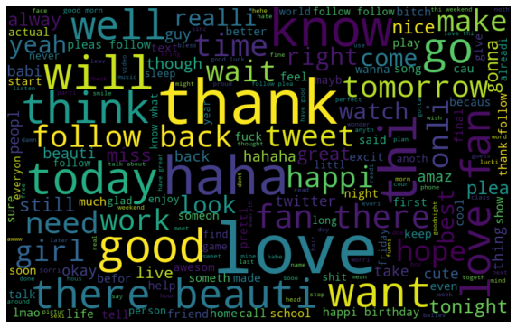
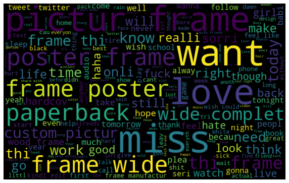
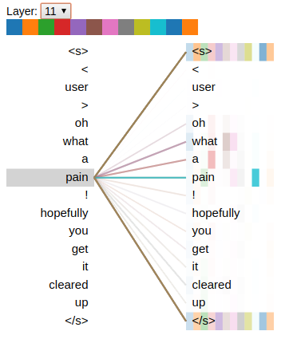
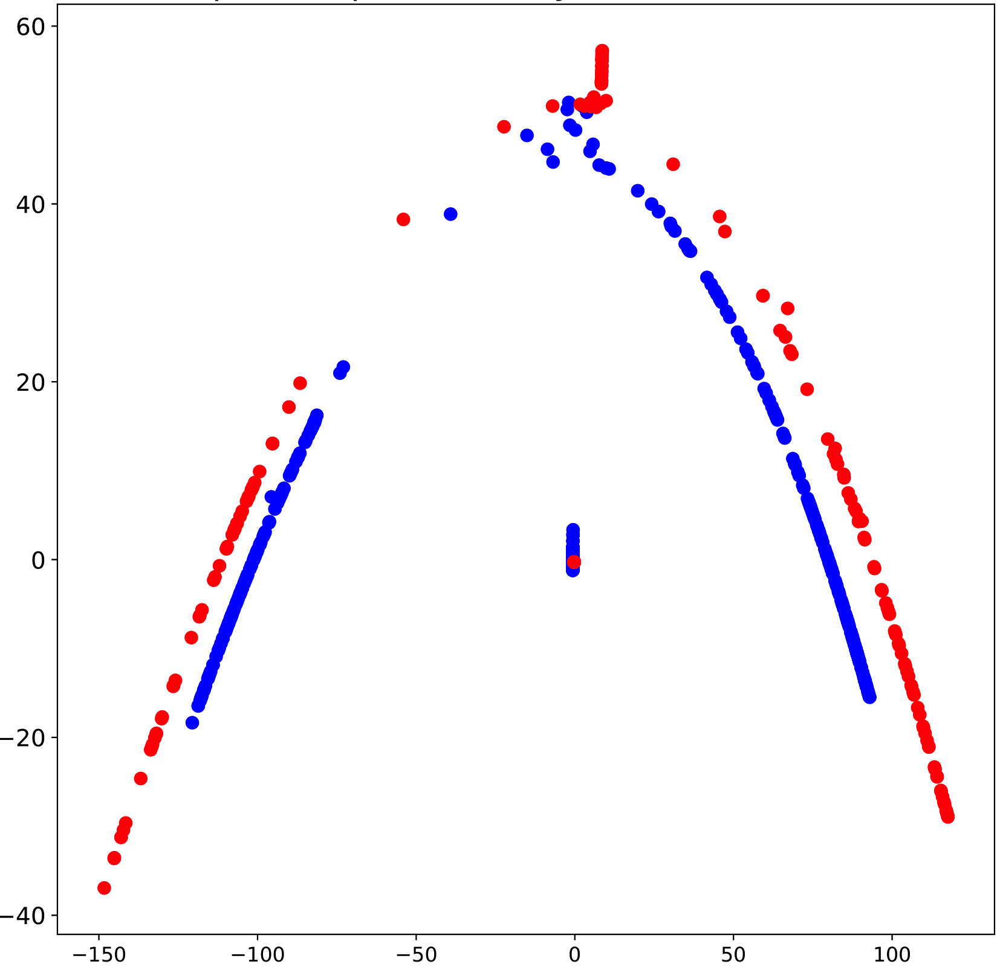

# CIL

## 1. Dataset
The dataset can be accessed from the [kaggle](https://www.kaggle.com/c/cil-text-classification-2020/data) competition.

Below are the word clouds for positive (left) and negative (right) class.

<!---->

## 2. Installing Dependencies
`pip install -r requirements.txt`

## 3. Running Proposed Model
Package `proposed` contains the code for our best performing model.
This package contains training and prediction code for XLNet, SpacyCNN, BERT and RoBERTa as well as taking ensemble.
#### Training
These models can be trained using commands mentioned below:

`python main.py train --model <model_type> --exp_name <exp_name>`

| model_type | command |
| ------ | ------ |
| spacycnn | `python main.py train --model spacycnn --exp_name mycnn01` |
| xlnet | `python main.py train --model xlnet --exp_name myxlnet02` |
| bert | `python main.py train --model bert --exp_name mybert03` |
| roberta | `python main.py train --model roberta --exp_name myroberta04` |

Output checkpoints and prediction csv can be found in the path `exps/<exp_name>`

#### Predictions
Similarly Predictions can be done using a checkpoint as follows:

| model_type | command |
| ------ | ------ |
| spacycnn | `python main.py predict --model spacycnn --exp_name mycnn01 --checkpoint weights_1.pth` |
| xlnet | `python main.py predict --model xlnet --exp_name myxlnet02 --checkpoint weights_1.pth` |
| bert | `python main.py predict --model bert --exp_name mybert03 --checkpoint weights_1.pth` |
| roberta | `python main.py predict --model roberta --exp_name myroberta04 --checkpoint weights_1.pth` |

Here `exp_name` is the name of experiment we did earlier, and checkpoint is the model dump located in `exps/<exp_name>` directory

#### Ensemble
File `proposed/ensemble.py` take ensemble of pretrained models using logits values for both the classes.
As input, it requires csv files containing logits values of both the classes.
We have specified 5 such files in `ensemble.py` (more can added if required).
One can choose any combination of these files to produce an ensemble.

We tried two ways of taking an ensemble:
1. Converting logits to probabilities using softmax and taking average over all models (Default Setting)
2. Majority voting

One can create submission file from the ensemble as follows:
`python main.py ensemble`

#### Configurations
Path for Training and Testing file can be adjusted by changing values in `proposed/constants.py`. For the purpose of illustration we have uploaded a very small dataset of 100 rows in the `data` directory and set it as default.

#### References
We have used [this blog](http://mccormickml.com/2019/07/22/BERT-fine-tuning/) by Chris McCormick and Nick Ryan as our reference.
We have used multiple code snippets (in exact/modified form) from this blog.

## 4. Analysis
Code for analysis is included in the analysis directory. Below is the summary of steps needed to reproduce the results listed in analysis section.

#### Visualization of attention scores
To visualize the attention score for predicting each token, we used the [bertvis](https://github.com/jessevig/bertviz) tool. We specifically used the attention head view for pre-trained RoBERTa models implemented in [Hugging face](https://huggingface.co/transformers/model_doc/roberta.html) library in pytorch.

#### Sentiment Extraction
To analyze which sub texts contribute in sentiments, we used the training data and kernels from a different [kaggle competition](https://www.kaggle.com/c/tweet-sentiment-extraction). We focused on analysing Roberta based models and extracted the positive and negative subtexts for the test data. The resulting subtexts are included in the repo.

#### Feature visualization
We project the extracted features to 2D space in order to understand the learnt models. Below is the visualization for RoBERTa features, red points belong to the negative class, blue being the positive ones.

<!---->

## 5. Baselines
Code for all the baselines is included in the baselines package. Simply do `cd baselines`
#### Glove

Download the glove twitter embeddings using

`wget http://nlp.stanford.edu/data/glove.twitter.27B.zip; unzip glove.twitter.27B.zip`

Move the extracted contents in a separate folder named `glove.twitter.27B`

run `python train_glove.py`, to create the embedding

<!--## Features-->
<!--Extracted features [Polybox](https://polybox.ethz.ch/index.php/s/zDcAaDWImcKxzqG), [GoogleDrive](https://drive.google.com/drive/folders/1mmMVJ1QdEOejXAIMDdcZDdnPlS2fg4Mz?usp=sharing)-->

<!--Contains features from roberta, xlnet as of now-->
